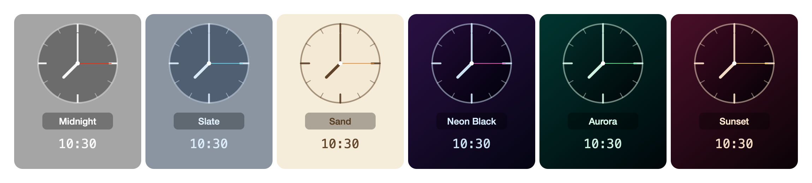
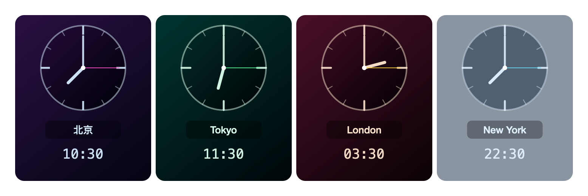
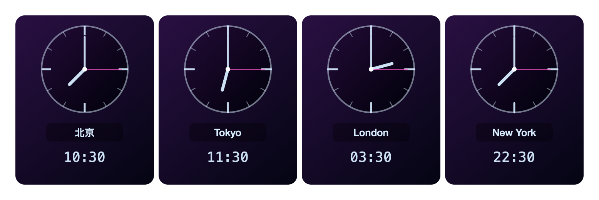

# cc-times · macOS 多时区桌面时钟

[](https://opensource.org/licenses/MIT)
[](https://www.apple.com/macos/)

> 仓库地址:<https://github.com/abesf/macostimes> · 项目名:**cc-times**

**🌐 语言:** [中文(默认)](#中文) · [English ▶ 点击展开](#english)

---

<a id="中文"></a>

一个常驻 macOS 桌面的多时区时钟。透明无边框窗口悬浮在桌面顶部,一眼看清全球多个城市的时间。

## 特性

- 🕐 **多时区同屏** — 每个时钟 = 模拟表盘 + 城市名 + 数字时间
- 🌍 **增删时区** — 右键从 24 个常用城市(覆盖每个整点 UTC 偏移)添加/删除
- 📏 **两种模式** — 完整(表盘+数字)/ 简版(仅数字+城市)
- 🎨 **6 套配色** — Midnight/Slate/Sand(实色)+ Neon Black/Aurora/Sunset(渐变)
- 🌈 **每时区独立配色** — 可单独给某个时钟设主题,或跟随全局
- 🌐 **中英双语** — 运行时切换 **中文 / English**
- 🪟 **透明悬浮窗** — 无边框、半透明深色,不挡视线
- ✋ **可拖动** — 拖到任意位置,支持主屏/副屏
- 🎚️ **透明度调节** — 100% / 80% / 60% / 45% / 30%
- 📌 **常驻置顶开关** — 悬浮置顶 / 普通窗口
- 💾 **配置持久化** — 时区、语言、主题重启后保留
- ⏱️ **自动夏令时** — 系统时区库内置

## 截图

**6 套主题并排对比:**
<br>

**每时区独立配色:**
<br>

**Neon Black · 五彩斑斓的黑:**
<br>

**简版模式:**
<br>

## 环境要求

| 项目 | |
|------|-|
| macOS | 12.0 (Monterey) 或更高 |
| 构建 | Swift Command Line Tools,**无需 Xcode** |

## 快速开始

```bash
make start    # 编译 + 启动(后台运行)
```

时钟会出现在主屏顶部居中。

## 命令

| 命令 | 作用 |
|------|------|
| `make start` | 编译 + 启动 |
| `make stop` | 停止 |
| `make restart` | 编译 + 重启 |
| `make build` | 仅编译(本机架构) |
| `make build-universal` | 编译通用二进制(Apple Silicon + Intel) |
| `make icon` | 生成 AppIcon.icns |
| `make shots` | 生成展示截图 |
| `make bundle` | 组装 .app(含图标 + Info.plist) |
| `make dmg` | 打包 .dmg(通用版,未签名) |
| `make clean` | 清理产物 |

## 右键菜单

```
删除时区    ▶  洛杉矶 / 北京 / 东京 / ... (24 城,每项带 UTC 偏移)
添加时区    ▶  同上
主题        ▶  午夜 / 石板 / 沙色 / 五彩斑斓的黑 / 极光 / 日落
单独配色    ▶  给某个时钟单独设主题(或跟随全局)
窗口透明度  ▶  100% / 80% / 60% / 45% / 30%
语言        ▶  中文 / English
✓ 常驻置顶     切换 悬浮置顶 / 普通窗口
✓ 简版(仅数字)  切换 完整 / 简版
─────────
退出
```

## 安装 DMG

DMG **未签名**(个人开源项目,见[贡献说明](#贡献说明))。首次打开:

1. 挂载 `.dmg`,把 `cc-times.app` 拖到 `/Applications`
2. **右键** App → **打开** → 在弹窗中确认(仅一次);或终端执行
   `xattr -d com.apple.quarantine /Applications/cc-times.app`

> 💡 DMG 是**通用版**(同时含 Apple Silicon + Intel),所有 Mac 直接可用,无需选择。

## 配置

时区与设置持久化到:

```
~/.config/mtimes/clocks.json      # 时区列表
~/.config/mtimes/settings.json    # 模式 / 透明度 / 置顶 / 主题
```

语言选择存在 `~/Library/Preferences`(UserDefaults)。

## 技术栈

- **SwiftUI** + **AppKit**(纯原生,零第三方依赖)
- `TimelineView` + `Canvas` 绘制表盘(macOS 12+)
- `Foundation.TimeZone` 时区计算(含夏令时)
- borderless `NSWindow`(`.floating` + `isMovableByWindowBackground`)实现透明悬浮可拖动
- 代码内嵌字典实现即时、无 bundle 的语言切换

## 项目结构

```
Sources/
├── ClockApp.swift          # 入口 + AppDelegate
├── WindowManager.swift     # 窗口配置 + 右键菜单 + 窗口尺寸
├── ClockStore.swift        # 时区列表 + 持久化设置
├── Theme.swift             # 6 套配色(实色 + 霓虹渐变)
├── L10n.swift              # i18n:语言、字符串表、运行时切换
├── CityRegistry.swift      # 24 个精选城市(每 UTC 偏移一个)+ 本地化名
├── AnalogClockView.swift   # Canvas 绘制表盘
├── ClockCardView.swift     # 单个时钟卡片(完整/简版)
└── ClockRowView.swift      # 横排时钟 + 每秒刷新
scripts/
├── make_icon.swift         # 生成 AppIcon.icns(CoreGraphics)
└── make_shots.swift        # 生成展示截图(离屏渲染)
```

## 已知限制

- **壁纸层(.desktop)无法交互** — macOS 不向该层窗口派发鼠标事件,故默认用悬浮层(.floating)。可用透明度和置顶开关调节遮挡感。

## 协议

本项目基于 [MIT 协议](LICENSE)开源。

<a id="贡献说明"></a>
## 贡献说明

本项目以 MIT 协议开源,欢迎阅读、使用、复刻(Fork)并基于此修改自己的版本。

但这是一个个人项目,**目前暂不接受外部贡献**。Pull Request、功能建议和 Issue 提交均已关闭,恕不一一回复。如果你觉得代码有用,欢迎自行 Fork 后做自己的版本,感谢理解!

---
---

<details>
<summary><b>🌐 English (click to expand) ▶</b></summary>

<a id="english"></a>

# cc-times · Multi-Timezone Desktop Clock for macOS

A lightweight desktop clock that stays on your macOS desktop and shows the time
in multiple world cities at a glance. Transparent, borderless, draggable, and
quietly out of the way.

## Features

- 🕐 **Multi-timezone at a glance** — each clock shows an analog face + city name + digital time
- 🌍 **Add / remove time zones** — curated list of 24 world cities (one per whole-hour UTC offset)
- 📏 **Two display modes** — full (analog + digits) or compact (digits + city only)
- 🎨 **6 color themes** — Midnight / Slate / Sand (solid) + Neon Black / Aurora / Sunset (gradients)
- 🌈 **Per-clock color** — override the theme for individual clocks, or follow the global one
- 🌐 **Bilingual UI** — switch between **English** and **中文** at runtime
- 🪟 **Transparent floating window** — borderless, dark translucent, won't block your view
- ✋ **Draggable** — drag anywhere, across main and external displays
- 🎚️ **Adjustable opacity** — 100% / 80% / 60% / 45% / 30%
- 📌 **Always-on-top toggle** — float over windows or behave like a normal one
- 💾 **Settings persist** — your clocks, language, theme, and preferences survive restarts
- ⏱️ **DST-aware** — daylight saving handled automatically by the system time zone database

## Screenshots

**All six themes side by side:**
<br>

**Per-clock colors:**
<br>

**Neon Black · the "colorful black":**
<br>

**Compact mode:**
<br>

## Requirements

| | |
|-|-|
| macOS | 12.0 (Monterey) or later |
| Build | Swift Command Line Tools — **no Xcode required** |

## Quick Start

```bash
make start    # build + launch (runs in the background)
```

The clock appears at the top-center of your main display.

## Commands

| Command | Action |
|---------|--------|
| `make start` | Build + launch |
| `make stop` | Stop the running clock |
| `make restart` | Rebuild + restart |
| `make build` | Build only (native arch) |
| `make build-universal` | Build universal binary (Apple Silicon + Intel) |
| `make icon` | Generate AppIcon.icns |
| `make shots` | Render screenshots |
| `make bundle` | Build a `.app` bundle (with icon) |
| `make dmg` | Build a `.dmg` (universal, unsigned) |
| `make clean` | Remove build artifacts and logs |

## Right-Click Menu

```
Remove Time Zone   ▶  Los Angeles / Beijing / Tokyo / ... (24 cities, with UTC offset)
Add Time Zone      ▶  same list
Theme              ▶  Midnight / Slate / Sand / Neon Black / Aurora / Sunset
Per-Clock Color    ▶  override a single clock's theme (or follow global)
Window Opacity     ▶  100% / 80% / 60% / 45% / 30%
Language           ▶  中文 / English
✓ Always on Top       toggle floating / normal window level
✓ Compact (digits only)   toggle full / compact mode
─────────
Quit
```

## Installing the DMG

The DMG is **not code-signed** (personal open-source project; see
[Contributing](#contributing)). To open it the first time:

1. Mount the `.dmg` and drag `cc-times.app` to `/Applications`.
2. **Right-click** the app → **Open** → confirm in the Gatekeeper dialog
   (one-time). Or run: `xattr -d com.apple.quarantine /Applications/cc-times.app`

> 💡 The DMG is **universal** (Apple Silicon + Intel in one) — works on any Mac.

## Configuration

Clocks and settings are persisted to:

```
~/.config/mtimes/clocks.json      # time zone list
~/.config/mtimes/settings.json    # mode / opacity / always-on-top / theme
```

Language choice is stored in `~/Library/Preferences` (UserDefaults).

## Tech Stack

- **SwiftUI** + **AppKit** — pure native, **zero third-party dependencies**
- `TimelineView` + `Canvas` for the analog face (macOS 12+)
- `Foundation.TimeZone` for zone-accurate time and automatic DST
- borderless `NSWindow` (`.floating`, `isMovableByWindowBackground`) for the transparent, draggable overlay
- In-memory string tables for instant, bundle-free language switching

## Project Structure

```
Sources/
├── ClockApp.swift          # entry point + AppDelegate
├── WindowManager.swift     # window setup + context menu + window metrics
├── ClockStore.swift        # clock list + persisted settings
├── Theme.swift             # 6 color themes (solid + neon gradients)
├── L10n.swift              # i18n: languages, string tables, runtime switch
├── CityRegistry.swift      # 24 curated cities (one per UTC offset) + localized names
├── AnalogClockView.swift   # Canvas-drawn analog face
├── ClockCardView.swift     # single clock card (full / compact)
└── ClockRowView.swift      # horizontal row of clocks, per-second refresh
scripts/
├── make_icon.swift         # generates AppIcon.icns (CoreGraphics)
└── make_shots.swift        # renders promo screenshots (offscreen)
```

## Known Limitations

- **The desktop wallpaper level (`.desktop`) cannot be interacted with** — macOS does not deliver mouse events to windows at that level, so the clock uses the floating level (`.floating`). Use the opacity and always-on-top options to tune how intrusive it feels.

## License

This project is licensed under the [MIT License](LICENSE).

<a id="contributing"></a>
## Contributing

This project is open source under the MIT License — you are free to read, use,
fork, and modify the code for your own purposes.

However, this is a personal project and is **not accepting external
contributions at this time**. Pull requests, feature requests, and issues are
disabled and will not be reviewed. If you find the code useful, you're welcome
to fork it and build your own version. Thank you for understanding!

</details>
